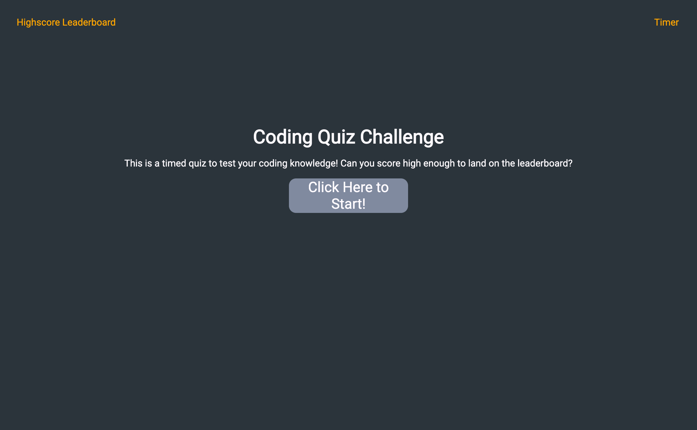

# Code Quiz
  
  

## Summary

A (brief) timed coding quiz with multiple choices that runs in the browser. Features dynamically updated HTML and CSS powered by JavaScript.

## Deployment
https://katiechurchwell.github.io/code-quiz/

## Demo/Screenshot

## Questions
  If you have any questions about this project, please open an issue or use the contact information below:
  * [katiechurchwell](https://www.github.com/katiechurchwell)
  * [churchwellcatherine@gmail.com](mailto:churchwellcatherine@gmail.com)

---
  